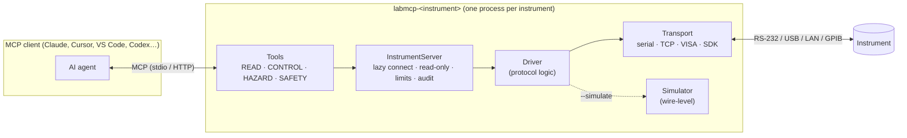

# Architecture

## Layers

| Layer | Lives in | Responsibility |
|---|---|---|
| **Tools** | `servers/*/*/src/*/server.py` | Scientist-level operations with typed, bounded inputs and structured outputs. Each tool has a kind (`READ`/`CONTROL`/`HAZARD`/`SAFETY`). |
| **InstrumentServer** | `packages/labmcp/src/labmcp/server.py` | Wraps `FastMCP`: lazy, thread-safe connection; `--simulate`; `--read-only`; safety limits; audit log; the CLI; built-in `get_connection_info` / `get_command_log` / `reconnect`. |
| **Driver** | `servers/*/*/src/*/driver.py` | Pure protocol implementation. No MCP code, so it can be reused from scripts and notebooks. |
| **Transport** | `packages/labmcp/src/labmcp/transports/` | Moves bytes: `SerialTransport` (pyserial), `TCPTransport`, `VisaTransport` (PyVISA), `SimulatedTransport`. All share locking, line handling, timeouts and auditing. |
| **Simulator** | `servers/*/*/src/*/simulator.py` | Emulates the instrument **at the wire level**, so `--simulate` and the tests exercise the same parsing code as real hardware. |

## Design decisions

- **One package per instrument family.** Scientists install only what they need (`uvx labmcp-ika`), dependencies stay small, and each server can be versioned and verified independently. The `labmcp` core keeps behaviour consistent across servers.
- **Lazy connection.** MCP clients start servers when they launch, often before the instrument is switched on. Servers start instantly and connect on first use. If the instrument is off, the tool call returns a clear error ("check the cable / power; run `--check`") instead of the whole server failing to start.
- **Sync drivers, threaded tools.** Most instrument libraries (pyserial, PyVISA, vendor SDKs) are blocking. FastMCP runs sync tools in a thread pool and handles requests concurrently, and each transport serialises access with a re-entrant lock. So a stop tool can run while a long tool is in progress, but its command waits until that tool releases the transport lock: drivers hold the lock per exchange, not for a whole sweep. `reconnect` closes the transport without waiting for the lock, which makes a blocked read in another thread fail at once with `InstrumentConnectionError`. If `connect` fails, the core closes every transport it opened through `ctx.open_transport`.
- **No server→client callbacks.** The MCP `2026-07-28` protocol is sessionless, so tools never depend on mid-call elicitation. Confirmation for hazardous actions comes from the client, via the `destructiveHint` annotation, and safety comes from server-side limits that the model can't override.
- **Addresses are URIs.** `serial:///dev/ttyUSB0?baudrate=9600`, `tcp://10.0.0.5:5025`, `visa://GPIB0::22::INSTR`. The driver supplies factory defaults, and query parameters override them.
- **Everything is data-first.** Measurements come back as Pydantic models with units in the field names and timestamps. Large data (spectra, waveforms) is summarised by default and can be saved to disk in full.

## Configuration reference

Every server accepts the same options (CLI flag / environment variable):

| Flag | Env var | Meaning |
|---|---|---|
| `--address` | `LABMCP_ADDRESS` | Instrument address (see above) |
| `--simulate` | `LABMCP_SIMULATE=1` | Use the built-in simulator |
| `--read-only` | `LABMCP_READ_ONLY=1` | Hide all CONTROL and HAZARD tools |
| `--limit name=value` | `LABMCP_LIMITS=a=1,b=2` | Override safety limits |
| `--option name=value` | `LABMCP_OPTIONS=a=1,b=2` (or a JSON object) | Driver-specific options |
| `--timeout s` | `LABMCP_TIMEOUT` | Reply timeout |
| `--audit-log path` | `LABMCP_AUDIT_LOG` | Append all traffic to a JSONL file |
| `--check` | | Connect, print instrument info as JSON, exit |
| `--transport http --host --port` | | Serve over streamable HTTP instead of stdio |
